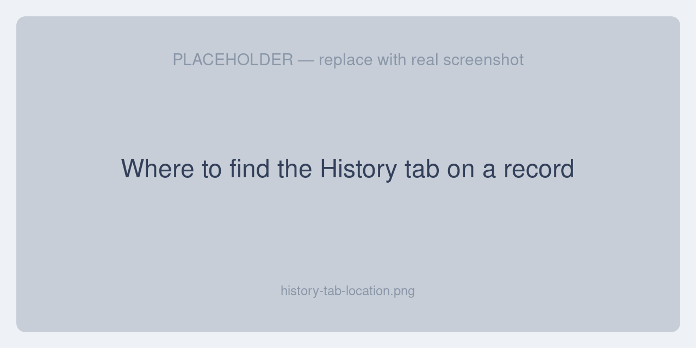
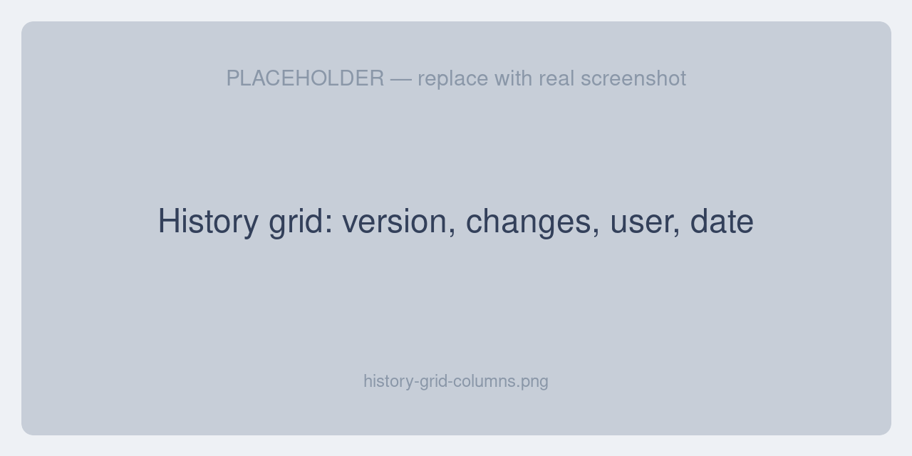

# The History Tab

The extension works entirely inside Unopim's existing **History** tab — there is no separate menu or screen to learn. This page explains where to find the tab and how to read its contents.

## Finding the History tab

Open any record that supports history and look for the **History** tab on its edit screen. Records that support history include:

- **Products**
- **Categories**, category fields, and field options
- **Attributes**, attribute groups, and attribute families
- **Channels**
- **Users** and **roles**
- **Webhook settings**
- **DAM assets**

::: tip
The History tab only appears once a record has been changed at least once. A brand-new record with no edits yet may show an empty history.
:::

## Reading the history grid

The History tab lists every saved version of the record, newest first. Each row represents one save and shows:

| Column | What it shows |
|---|---|
| **Version** | The sequential version number for this record. |
| **Changes** | The fields that changed, with their old and new values. File fields appear as thumbnails. |
| **User** | The admin user who made the change. |
| **Date** | When the change was saved. |
| **Action** | The **Restore** action (shown when you have permission). |

## What counts as a version

A version is created every time a record is saved with at least one changed value. A single save can change several things at once — for example a product's name, its translated label, and a related value. The extension treats all of those as **one version**, so when you restore it, they roll back together. See [Restoring a Version](./restoring-versions#grouped-restore) for details.

## Next steps

- [Previewing Files](./previewing-files) — open thumbnails and play media from history
- [Restoring a Version](./restoring-versions) — roll the record back to an earlier version
