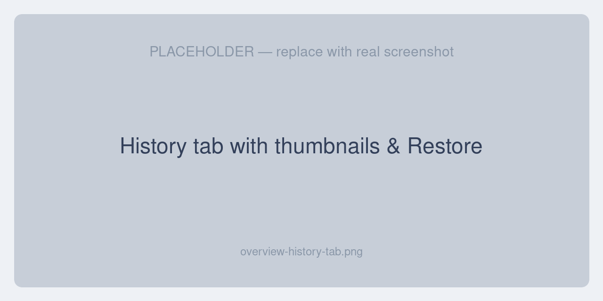

# Version History Restore

The **Version History Restore** extension supercharges Unopim's built-in **History** tab. It adds inline file thumbnails and **one-click version restore** to the change history of products, categories, attributes, channels, users, roles, webhook settings, and DAM assets — all without editing any Unopim core files.

Whenever a record is changed in Unopim, the platform already records an audit entry. This extension turns those entries into something your catalog team can actually use: you can *see* what a previous version looked like (including image, video, audio, and PDF previews) and roll a record back to any earlier version with a single click.

## Why use it

Out of the box, Unopim's History tab records *that* something changed, but the data is hard to read and there's no way to undo a change from the UI. Version History Restore closes both gaps:

- **See what changed, visually.** File fields render as thumbnails right in the grid, so a catalog manager can recognise the old image at a glance instead of reading a file path.
- **Undo mistakes safely.** A bad bulk edit, an accidental deletion, or a wrong translation can be rolled back to any earlier version in one click — without a developer or a database restore.
- **Keep a clean audit trail.** Every restore is itself recorded, so you always know who rolled back what, when, and from which version.

## How it works

- Every Unopim module that uses the History trait automatically gains a **Restore** action in its History grid — no per-module setup.
- Clicking **Restore** re-applies that version's values to the record. The change is itself saved as a *new* history entry, so **nothing in your history is ever destroyed** — the current state simply becomes the next version you can roll back to.
- A single restore reverts everything that changed together in that version — a parent field, its translated labels, and related pivot data (such as a channel's currencies and locales) all roll back as one transaction.
- Records that were soft-deleted are automatically un-deleted before the older values are re-applied.
- File values in the history grid render as **inline thumbnails**, and a preview modal lets you zoom images, play video/audio, and download documents.

## Key features

| Feature | Description |
|---|---|
| One-click restore | Roll any record back to any earlier version from its History tab. |
| Restore any version | By default every version is restorable, not just the most recent one. |
| Non-destructive | Restoring creates a new version; history is never overwritten. |
| Grouped restore | Parent fields, translations, and pivot relations roll back together. |
| Soft-delete revival | Deleted records are restored before older values are re-applied. |
| Inline file previews | Image, video, audio, and PDF thumbnails directly in the History grid. |
| Preview modal | Zoom images, play media, and download documents. |
| Asset file preservation | Re-uploading a DAM asset keeps the old file so it can be restored later. |
| Restore lineage | Each restore records who restored it, when, and from which version. |
| Permission-aware | Restore is gated by dedicated ACL permissions. |
| Retention command | A purge command keeps audit tables tidy while always keeping each record's latest version. |
| Broad coverage | Products, categories, attributes, families, channels, users, roles, webhook settings, and DAM assets. |

## What can be restored

- Products
- Categories, category fields, and field options
- Attributes, attribute groups, and attribute families
- Channels (code, root category, translated names, currencies, and locales)
- Admin users and roles (including permissions)
- DAM assets (path, file name, type, and tags)
- Webhook settings

See [Supported Files & Coverage](./supported-files) for the full list of restorable entities and previewable file types.

## Requirements

- **Unopim** with History (audit) support enabled
- PHP 8.3+
- MySQL or PostgreSQL with JSON column support
- **DAM** is optional — required only for asset re-upload preservation and asset thumbnails
- `ffmpeg` (video frame thumbnails) and `poppler-utils` / `pdftoppm` (PDF page thumbnails) are optional; image and audio previews need neither

## In this guide

**Getting Started**
- [Installation](./installation) — install and enable the extension

**User Guide**
- [The History Tab](./history-tab) — where to find it and how to read it
- [Previewing Files](./previewing-files) — thumbnails and the preview modal
- [Restoring a Version](./restoring-versions) — roll a record back in one click

**Configuration**
- [Settings](./settings) — restore modes, storage disks, and previews
- [Permissions & Access](./permissions) — who can view history and restore

**Maintenance**
- [Purging Old History](./purging-history) — keep audit tables tidy

**Reference**
- [Supported Files & Coverage](./supported-files)
- [Troubleshooting & FAQ](./troubleshooting)
