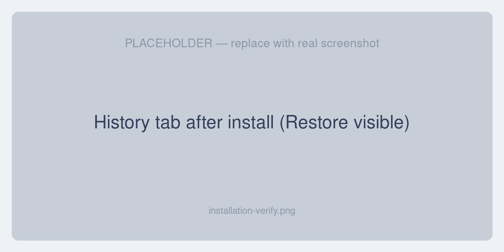

# Installation

## Requirements

- **Unopim** with History (audit) support enabled
- PHP 8.3+
- MySQL or PostgreSQL with JSON column support
- **DAM** is optional (needed only for asset re-upload preservation and asset thumbnails)
- Optional system tools for richer previews:
  - `ffmpeg` — generates thumbnails from video frames
  - `poppler-utils` (`pdftoppm`) — renders the first page of PDFs as a thumbnail

Image and audio previews work without any extra system tools.

## Steps

### 1. Merge the extension files

Unzip the package and copy the `packages/` folder into your Unopim project root, merging with the existing `packages/` directory. The extension should sit at:

```
packages/
└── Webkul/
    └── HistoryPreviewRestore
```

### 2. Register the service provider

Open `bootstrap/providers.php` and add the provider (Unopim runs on Laravel 12, which reads providers from this file rather than `config/app.php`):

```php
use Webkul\HistoryPreviewRestore\Providers\HistoryPreviewRestoreServiceProvider;

return [
    // ...existing providers...
    HistoryPreviewRestoreServiceProvider::class,
];
```

### 3. Update Composer autoload

In `composer.json`, add the namespace under `autoload.psr-4`:

```json
"autoload": {
    "psr-4": {
        "Webkul\\HistoryPreviewRestore\\": "packages/Webkul/HistoryPreviewRestore/src"
    }
}
```

### 4. Run the install commands

```bash
# Regenerate the autoloader so the new namespace is found
composer dump-autoload

# Add the metadata column used to track restore lineage
php artisan migrate

# Clear cached config, routes, and views
php artisan optimize:clear
```

The migration adds a single `metadata` JSON column to the existing `audits` table — no other schema changes are made.

### 5. Verify

- Open any record that has a change history (for example a product) and go to its **History** tab.
- You should see a **Restore** action on each version, and any image/file values should render as thumbnails.



If the Restore action does not appear, confirm the relevant role has the **History** and **Restore** permissions — see [Permissions & Access](./permissions).

## Next steps

- [The History Tab](./history-tab) — start using the feature
- [Settings](./settings) — choose a restore mode and configure previews
- [Permissions & Access](./permissions) — control who can restore
