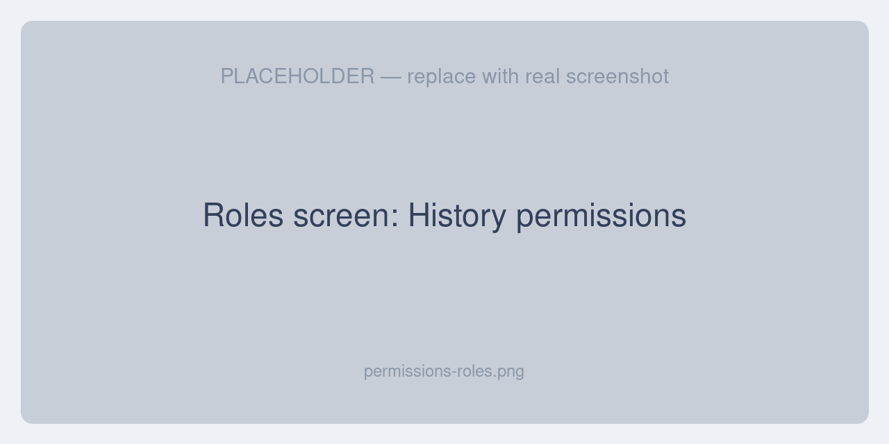
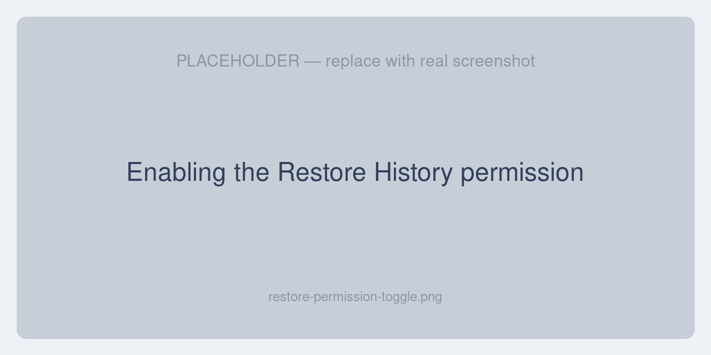

# Permissions & Access

Access to history and the Restore action is controlled through Unopim's role-based access control (ACL).

## The two permissions

The extension adds two permissions under a **History** group:

| Permission | Allows |
|---|---|
| **History** | View the History tab on a record. |
| **Restore History** | Click **Restore** on a version. |

## Assigning permissions

1. Go to **Settings → Roles**.
2. Edit the role you want to grant access to (or create a new one).
3. Find the **History** permission group and enable **History** and/or **Restore History**.
4. Save the role.

Users assigned to that role will see the History tab and the Restore action the next time they open a record.

## How the Restore action is gated

The **Restore** action uses a permissive gate. It appears when a user has **Restore History** *or* the edit permission for the record they're viewing. This means a user who can already edit a type of record can also restore its versions without being granted a separate permission.

| Record | Edit permission that also enables Restore |
|---|---|
| Product | Edit Products |
| Category / Category field | Edit Categories / Edit Category Fields |
| Attribute / Group / Family | Edit Attributes / Attribute Groups / Families |
| Channel | Edit Channels |
| User | Edit Users |
| Role | Edit Roles |
| DAM asset | Update Asset |
| Webhook setting | Update Webhook Settings |

For records from third-party modules that aren't in this map, the Restore action falls back to requiring only the **Restore History** permission.

## Permission messages

If a user without the right permission tries to restore or preview, they'll see a clear message:

- *“You don't have permission to restore history versions. Please contact your administrator.”*
- *“You don't have permission to preview files from history. Please contact your administrator.”*
- *“Please sign in to view history previews.”* (when the session has expired)

## Next steps

- [Settings](./settings) — restore modes and previews
- [Restoring a Version](./restoring-versions) — the restore workflow
