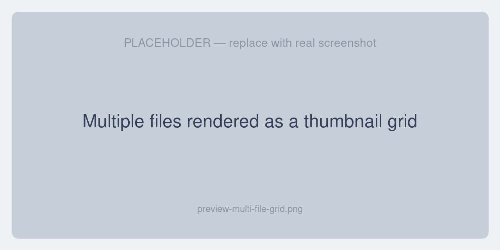

# Previewing Files

When a version contains a file value — an image, video, audio clip, or document — the extension shows it as an **inline thumbnail** in the History grid instead of a raw file path. This makes the History tab usable for catalog teams, not just developers.

## Inline thumbnails

File fields render directly in the grid as small previews. Images show the actual picture; video, audio, and document files show a representative thumbnail or type icon.

When a single field holds **multiple files** (a JSON array of files), they render as a grid of thumbnails so you can see all of them at once.

## The preview modal

Click any thumbnail to open the **preview modal**, a full viewer tailored to the file type.

### Images

For images you can:

- **Zoom in / out**
- **Rotate left / right**
- **Fit to screen** or view at **actual size**
- **Reset** all adjustments

### Video and audio

Media files open in a built-in player with:

- **Play / pause**, **mute / unmute**, and **loop**
- **Speed** control and **skip 10 seconds** back / forward
- **Fullscreen** and **picture-in-picture** (video)

### Documents

PDF, Office documents, CSV, and text files preview where the browser supports it. When a file type can't be shown in the browser, the modal displays *“This file type cannot be previewed in the browser.”* — use **Download** to save it locally.

### More actions

The preview's *More actions* menu also offers **Copy link**, **Open in new tab**, and **Download file**.

## When a file is missing

If a version refers to a file that has since been removed from storage, the grid shows *“File is not available on disk anymore.”* The version's other values can still be restored — only the file preview is unavailable.

## Supported file types

Images, video, audio, and a range of documents are supported. See the full list on the [Supported Files & Coverage](./supported-files#previewable-file-types) page.

## Next steps

- [Restoring a Version](./restoring-versions) — roll the record back to an earlier version
- [Settings](./settings#storage-disks) — configure where preview files are read from
