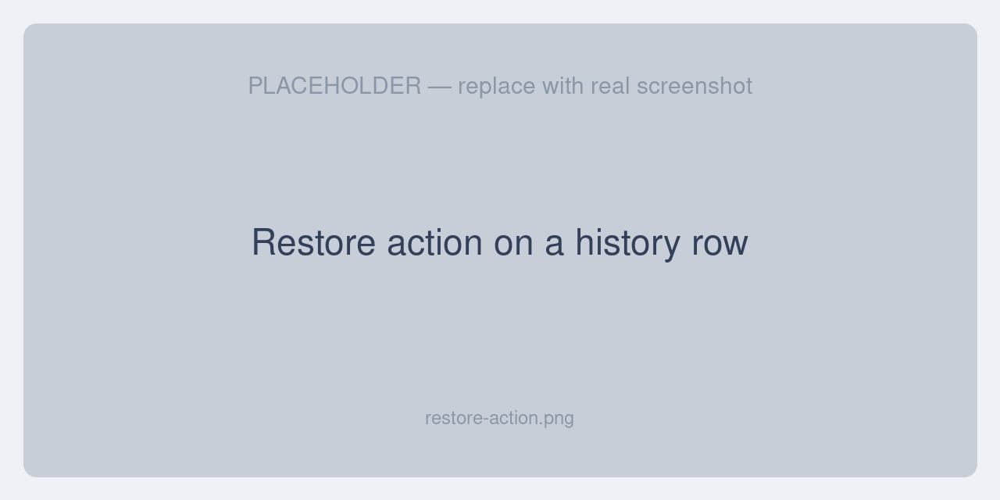
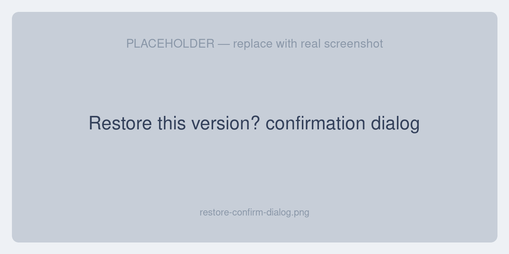
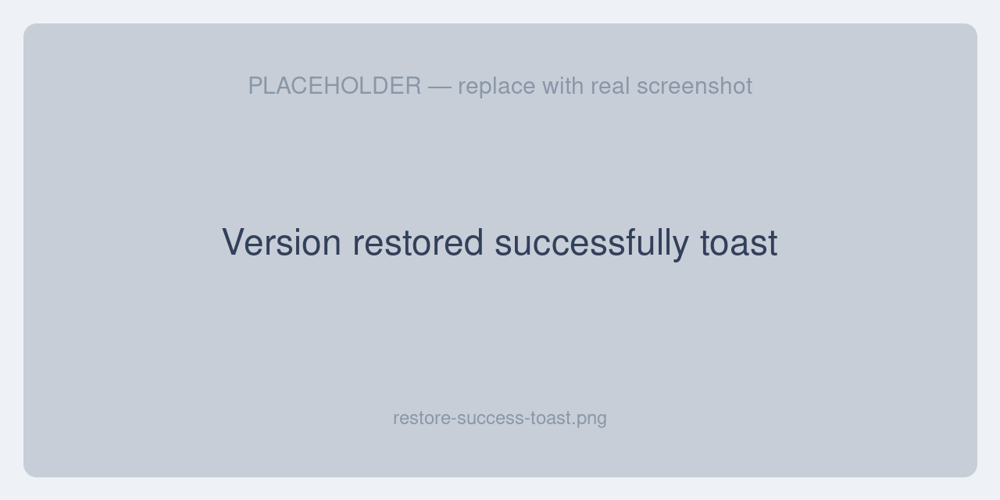
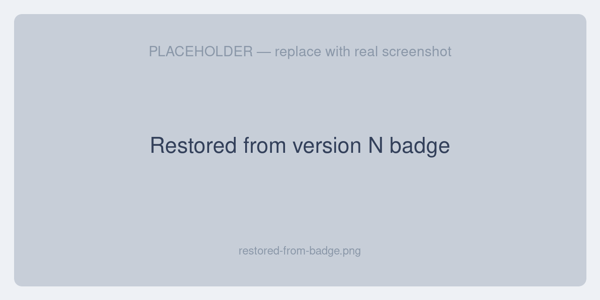
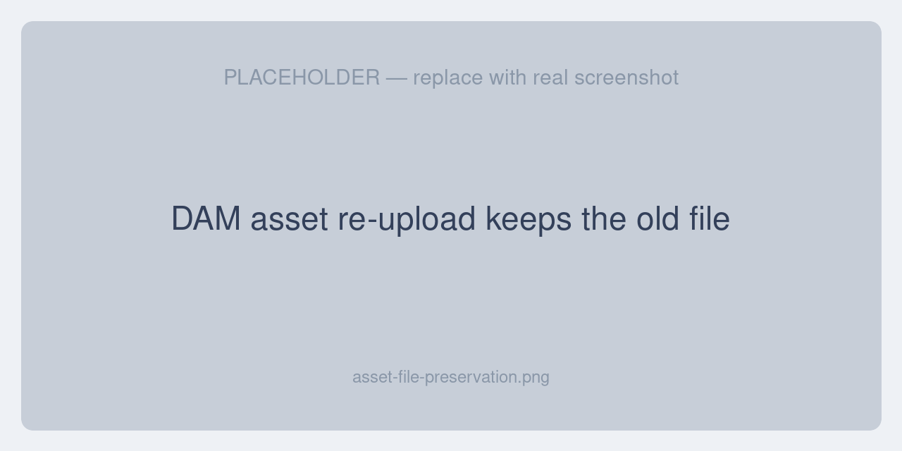

# Restoring a Version

Restoring rolls a record back to the values it had in an earlier version — in one click, and without losing any history.

## How to restore

1. Open the record and go to its **History** tab.
2. Find the version you want to roll back to.
3. Click **Restore** on that row.

4. A confirmation dialog appears — *“Restore this version?”* — reminding you that the current values will be replaced with this version's values, and that **the current state is kept in history**.

5. Confirm. The button shows *“Restoring…”* while the change is applied.

## Result messages

When the restore finishes you'll see one of these messages:

| Message | Meaning |
|---|---|
| **Version restored successfully.** | The record was rolled back to the selected version. |
| **Already at this version — no values were changed.** | The record already matched the selected version, so nothing changed. |
| **Restore failed. Please try again.** | The restore could not be completed — see [Troubleshooting](./troubleshooting). |

## What a restore does

### It is non-destructive

Restoring re-applies an older version's values and then saves the record, which creates a *new* history entry. Your previous “current” state is preserved as a version you can return to later. You can restore back and forth as many times as you like — history only ever grows.

### It restores everything that changed together {#grouped-restore}

If a single edit changed a parent field, a translated label, and a related pivot (for example a channel's currencies and locales), they all roll back together in **one transaction**. You never end up with a half-restored record.

### It revives deleted records

If the record was soft-deleted, it is automatically un-deleted before the older values are re-applied — so you can bring back a record that was removed, not just undo a field change.

## Restore lineage

Every restore is recorded. The restored version is stamped with **who** restored it, **when**, and **which version** it came from. The version detail shows a **“Restored from version N”** badge so the history of a rollback is always clear.

## Restoring DAM asset files

For DAM assets, re-uploading a file does not overwrite the previous one — the older file is kept under a unique name (for example `photo (1).jpg`). This means restoring an asset version brings back not just its metadata (name, type, tags) but the **actual earlier file** as well.

## Restore modes

By default, **any** version can be restored. A deployment can instead be configured for one-step undo, where only the most recent version is restorable. See [Settings → Restore modes](./settings#restore-modes).

## Who can restore

The **Restore** action only appears for users whose role grants it. See [Permissions & Access](./permissions).
