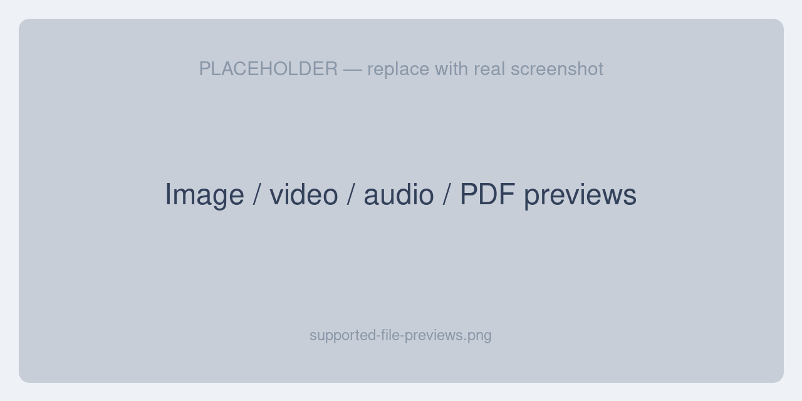

# Supported Files & Coverage

This page lists exactly what the extension can restore and which file types it can preview.

## Restorable entities

The Restore action works on every Unopim module that uses the History trait. Out of the box, the following are fully supported:

| Entity | What is restored |
|---|---|
| **Products** | Product fields and values. |
| **Categories** | Category data, plus category fields and field options. |
| **Attributes** | Attribute data and translated labels. |
| **Attribute groups** | Group data and translations. |
| **Attribute families** | Family data and translations. |
| **Channels** | Code, root category, translated names, currencies, and locales. |
| **Users** | Admin user accounts. |
| **Roles** | Roles including their permissions. |
| **DAM assets** | Path, file name, type, tags, and the actual file binary. |
| **Webhook settings** | Webhook configuration values. |

Records from third-party modules that use the History trait also gain a Restore action automatically; developers can register richer support for their own models — see [Settings → Advanced](./settings#advanced-per-model-overrides).

## Previewable file types

File values render as inline thumbnails and open in the preview modal. Supported types:

| Category | Extensions | Preview behaviour |
|---|---|---|
| **Image** | jpg, jpeg, png, gif, webp, svg, bmp | Zoom, rotate, fit, actual size |
| **Video** | mp4, mov, webm, avi, mkv | In-browser player; thumbnail from a frame |
| **Audio** | mp3, wav, ogg, m4a, flac | In-browser player |
| **Document** | pdf, doc, docx, xls, xlsx, csv, ppt, pptx, txt | In-browser preview where supported, otherwise download; PDF thumbnail of the first page |

- Fields containing **multiple files** render as a grid of thumbnails.
- Custom extensions can be added to any category in the configuration — see [Settings → Recognised file extensions](./settings#recognised-file-extensions).

## What's needed for each preview

| Preview | Requirement |
|---|---|
| Images | None |
| Audio | None |
| Video thumbnails | `ffmpeg` |
| PDF thumbnails | `poppler-utils` (`pdftoppm`) |

Without the optional tools, video and PDF files still appear and can be downloaded — only the generated thumbnail is unavailable.

## Localization

The admin interface for this extension is translated into a wide range of locales, covering major European, Asian, and right-to-left languages, so the History tab, preview modal, and restore messages appear in your admin's chosen language.
